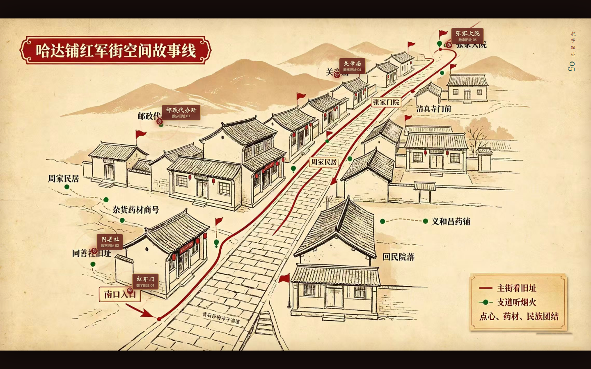
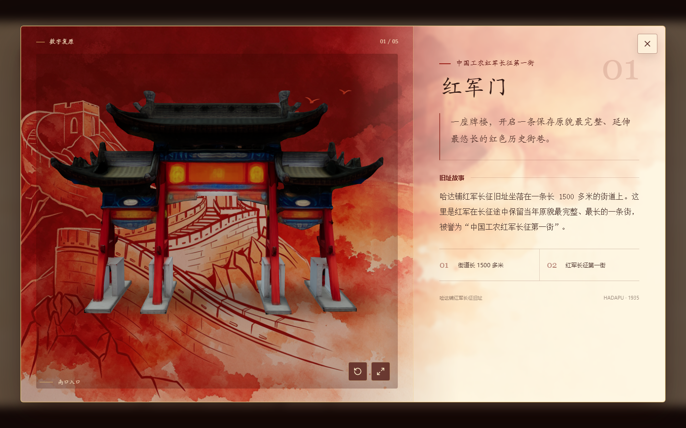
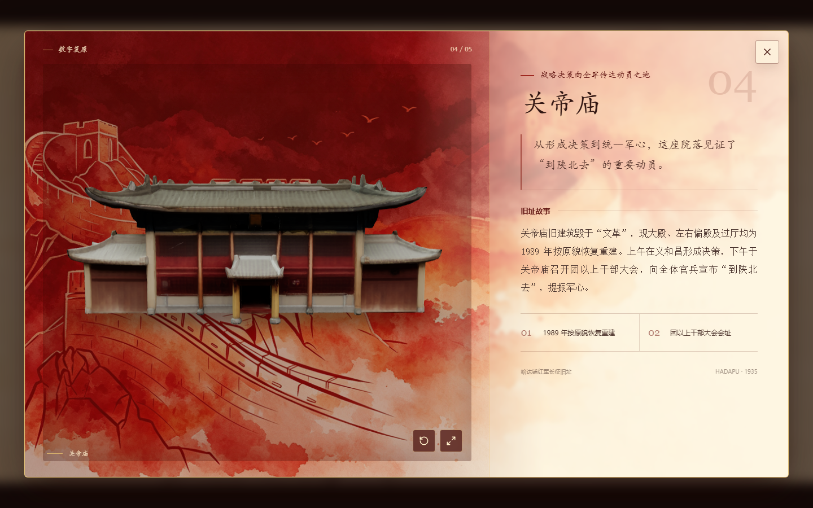

<div align="center">

<p align="center">
  
</p>

# 🧭 哈达铺红军街

### Red Army Street · Interactive 3D Heritage Map

把一条长征街巷放进地图，也把被时间保存的空间记忆重新交到每个人手中。

[](https://react.dev/)
[](https://threejs.org/)
[](https://vite.dev/)
[](https://pages.github.com/)

[在线体验](https://leizhidong-creator.github.io/Red-Army-Street/)

</div>

<p align="center">
  
</p>

<p align="center">
  
  
</p>

## 🌏 English abstract

**Red Army Street** is an interactive 3D heritage map for the revolutionary sites of Hadapu. Starting from a hand-drawn spatial story map, visitors can open five preserved sites, inspect their real-time GLB models, and read the historical stories connected to each location. The project translates a street, a map, and a set of memories into an accessible browser-based experience.

## 🗺️ 项目概览

哈达铺红军街是一条长 1500 多米、保存当年原貌较为完整的红色历史街巷，被誉为“中国工农红军长征第一街”。本项目以“空间故事线”手绘地图为入口，将红军门、同善社、邮政代办所、关帝庙、张家大院五处革命旧址组织成一条可以自由探索的数字路线。

用户不必按照固定顺序观看：地图上的微光热点对应真实地名，点击后即可进入详情层，旋转、缩放和观察建筑模型，并阅读与该处空间相关的历史故事。地图负责建立方向感，三维模型负责还原空间尺度，文字负责把一个地点重新放回历史现场。

## 🧭 核心体验

### 🗺️ 一张手绘地图，打开五处旧址

地图保留了原始手绘的路径、地名和叙事感。红色与金色微光只标记拥有 3D 模型的五处旧址，悬停或键盘聚焦后即可识别，避免把没有对应内容的地名做成空入口。

### 🏛️ 五处旧址，五段空间记忆

| 旧址 | 历史线索 | 入口 |
| --- | --- | --- |
| 红军门 | 中国工农红军长征第一街的南口入口 | [查看在线地图](https://leizhidong-creator.github.io/Red-Army-Street/) |
| 同善社 | 红一军团二师司令部与周恩来同志住室旧址 | [查看在线地图](https://leizhidong-creator.github.io/Red-Army-Street/) |
| 邮政代办所 | 从报纸中发现陕北信息的重要窗口 | [查看在线地图](https://leizhidong-creator.github.io/Red-Army-Street/) |
| 关帝庙 | “到陕北去”动员与统一军心之地 | [查看在线地图](https://leizhidong-creator.github.io/Red-Army-Street/) |
| 张家大院 | 红二方面军总指挥部旧址与多位将领住室 | [查看在线地图](https://leizhidong-creator.github.io/Red-Army-Street/) |

### 🧱 可旋转、可缩放的 3D 建筑

每个详情层都使用本地 GLB 模型。模型加载后会根据包围盒自动居中、落地和构图，用户可以拖拽旋转、滚轮缩放、重置视角，也可以进入全屏查看。模型区域与历史文案并列，既保留空间纵深，也保持阅读秩序。

### 📱 面向展陈的响应式阅读

桌面端使用模型与文案左右分栏，移动端改为模型在上、文字在下的纵向布局。详情层支持遮罩、关闭按钮和 `Escape` 退出，焦点会回到原来的地图热点，保证连续探索和键盘访问。

## 🧱 项目核心价值

### 1. 保护红色数字文化遗产

将红军长征沿途的重要旧址转化为可长期保存、复制和传播的数字资产，为红色文化遗产保护提供新的方式。

### 2. 还原红军长征的空间记忆

通过地图、三维建筑和历史故事相结合，使分散的革命旧址形成完整、直观的红色历史叙事。

### 3. 创新红色文化传播形式

将传统图文介绍转变为可观看、可操作、可探索的沉浸式体验，增强红色文化的感染力和传播力。

### 4. 探索红色文旅新范式

推动红色文化、数字技术与旅游体验融合，为线上参观、景区导览、研学教育和文旅宣传提供数字化载体。

### 5. 传承和弘扬革命精神

让更多人，特别是年轻群体，了解长征历史、感受革命精神，使红色记忆在数字时代得到持续传承。

## ⚙️ 技术实现

```text
手绘地图 / 历史文案 / 建模素材
                ↓
       地标数据结构化整理
                ↓
       GLB 包围盒测量与构图
                ↓
    React + Three.js / WebGL 场景
                ↓
    地图热点与 3D 详情层交互
                ↓
       GitHub Pages 静态部署
```

### 🧰 技术栈

- **React 19 + Vite**：组织地图、详情层、模型查看器和静态构建。
- **Three.js + React Three Fiber**：加载并渲染五处革命旧址的实时 GLB 模型。
- **Drei + OrbitControls**：提供模型加载、旋转、缩放、自动巡展和视角控制。
- **Lucide React**：提供关闭、重置、全屏等界面操作图标。
- **Vitest + Testing Library**：覆盖地标数据、相机构图和主要打开/关闭交互。
- **GitHub Actions + Pages**：自动测试、构建并发布公开体验地址。

## 🔍 工程细节

| 关注点 | 实现方式 | 结果 |
| --- | --- | --- |
| 模型大小与原点不一致 | 加载后测量包围盒，计算水平居中、落地偏移和相机距离 | 五个模型都能以完整轮廓进入视野 |
| 地图在不同屏幕上缩放 | 热点使用地图原图百分比坐标 | 桌面和移动端保持地名对应关系 |
| 3D 资源加载失败 | 模型查看器提供加载中、失败和重置状态 | 文案仍可阅读，页面不会整体崩溃 |
| 详情层影响底层地图 | 打开时锁定滚动，关闭时恢复焦点 | 鼠标、键盘和移动端操作路径一致 |
| 公开站点使用子目录 | 资源统一通过 `import.meta.env.BASE_URL` 解析 | 兼容 `/Red-Army-Street/` Pages 路径 |

## 🚀 本地运行

环境要求：Node.js 20+、pnpm。

```bash
pnpm install
pnpm dev
```

开发服务器默认由 Vite 提供本地地址。提交前运行完整验证：

```bash
pnpm test --run
pnpm lint
pnpm build
pnpm verify
```

网页构建只包含地图、长城水彩背景和五个 GLB。原始 DOCX 与建模参考照片不会进入公开站点。

## 🗂️ 目录速览

```text
public/assets/
├─ map.jpg                         # 哈达铺红军街手绘地图
├─ modal-bg.png                    # 详情层长城水彩背景
├─ models/                         # 五处旧址 GLB 模型
└─ partners/                       # 合作院校 Logo 与 README 横幅

src/
├─ data/landmarks.js               # 地标、文案、坐标和模型路径
├─ components/                     # 地图、详情层和模型查看器
├─ three/                          # 包围盒测量与相机构图算法
└─ styles.css                      # 地图、红金微光和响应式布局
```

## 🤝 合作信息

本项目由 **太原理工大学** 与 **西北师范大学** 团队学生合作完成，面向红色数字文化遗产保护、空间记忆还原和数字文旅传播展开探索。

- [太原理工大学官网](https://www.tyut.edu.cn/)
- [西北师范大学官网](https://www.nwnu.edu.cn/)
- [在线体验](https://leizhidong-creator.github.io/Red-Army-Street/)

## 📦 素材与 License

项目代码的许可证以仓库实际声明为准；第三方依赖、模型、字体和其他素材请分别遵循其原始许可证与使用条款。

<div align="center">

**让一条老街被看见，也让一段长征记忆继续抵达。**

</div>
